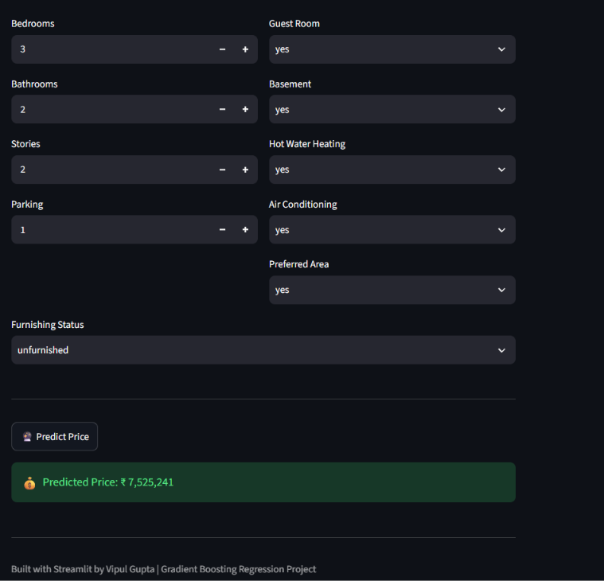

# 🏠 House Price Prediction

An end-to-end Machine Learning web application that predicts house
prices based on various property features.

The project uses data preprocessing, feature engineering and
Gradient Boosting Regression to generate house price predictions
through an interactive Streamlit interface.

---

## 🚀 Live Demo

[](https://house-price-prediction-bhqr76mp3eeugtzddfstku.streamlit.app/)

---

## 📌 Project Overview

House prices depend on several factors such as area, number of
bedrooms, bathrooms, parking availability and furnishing status.

This project uses Machine Learning to learn the relationship
between these features and house prices and provides predictions
through a user-friendly web application.

---

## 🧠 Machine Learning Workflow

```text
Raw Dataset
     ↓
Data Preprocessing
     ↓
Feature Encoding
     ↓
Train-Test Split
     ↓
Model Training
     ↓
Model Evaluation
     ↓
Gradient Boosting Regressor
     ↓
Streamlit Web Application
```
---

## 📊 Model Performance

During development, multiple regression models were evaluated.
The final application uses a Gradient Boosting Regressor because
it provided the best overall performance for this dataset.

| Model | R² Score |
|-------|----------|
| Linear Regression | ~0.54 |
| Gradient Boosting Regressor | ~0.68 |
| XGBoost | ~0.64 |

> **Note:** Performance may vary depending on preprocessing,
> train-test split and evaluation settings.

---
---

## 🛠️ Tech Stack

- **Python** — Programming language
- **Pandas & NumPy** — Data processing
- **Scikit-learn** — Machine Learning
- **Gradient Boosting Regressor** — Final model
- **Streamlit** — Web application
- **Joblib** — Model serialization

---

---

## 🖥️ Application Preview



---

---

## ⚙️ Installation

### 1. Clone the Repository

```bash
git clone https://github.com/Vipul24G/House-Price-Prediction.git
```
Install Dependencies
```
pip install -r requirements.txt
```
Run Application
```
streamlit run app.py
```

## 🔮 Future Improvements

- Improve model performance with additional feature engineering
- Add more data visualizations
- Add prediction explainability
- Experiment with advanced ensemble models
- Improve the user interface

---

## 👨‍💻 Author

**Vipul Gupta**

Final Year B.Tech CSE  
Interested in AI/ML, Generative AI, RAG and Agentic AI.

---

⭐ If you find this project useful, consider giving it a star!
